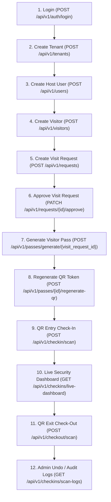

# ViziCheck API Test Execution Flow Guide

This document outlines the strict linear execution sequence required to test **ViziCheck** API endpoints without violating foreign keys or dependent entity preconditions.

---

## Linear Dependency Chain

---

## Detailed Step-by-Step Sequence

### Step 1: Authenticate (`POST /api/v1/auth/login`)
- **Prerequisite**: Database must be seeded (`python scripts/seed_testing_data.py`).
- **Action**: Authenticate as `admin@vizicheck.com` / `TestPassword123!`.
- **Automated Effect**: Saves `access_token`, `refresh_token`, `user_id`, and `tenant_id` into Postman Environment.

### Step 2: Create Tenant Organization (`POST /api/v1/tenants`)
- **Prerequisite**: Valid `access_token` with `SUPER_ADMIN` privileges.
- **Action**: Create a new tenant (e.g. `Infosys Technology Center`).
- **Automated Effect**: Saves new `tenant_id` into Postman Environment.

### Step 3: Create Tenant Host User (`POST /api/v1/users`)
- **Prerequisite**: `tenant_id` exists in database.
- **Action**: Register a host user (e.g., `amit.shah@capnis-infotech.com`).
- **Automated Effect**: Saves new `host_id` into Postman Environment.

### Step 4: Create Visitor (`POST /api/v1/visitors`)
- **Prerequisite**: `tenant_id` exists in database.
- **Action**: Register an external visitor (e.g., `Arjun Kapoor` from `Tech Mahindra`).
- **Automated Effect**: Saves new `visitor_id` into Postman Environment.

### Step 5: Submit Visit Request (`POST /api/v1/requests`)
- **Prerequisite**: Active `visitor_id`, `host_id`, and `tenant_id`.
- **Action**: Create a visit request in `PENDING` state.
- **Automated Effect**: Saves new `visit_request_id` into Postman Environment.

### Step 6: Approve Visit Request (`PATCH /api/v1/requests/{id}/approve`)
- **Prerequisite**: `visit_request_id` must be in `PENDING` status.
- **Action**: Host or Admin approves the visit request.
- **Effect**: Transitions status to `APPROVED`.

### Step 7: Generate Visitor Pass (`POST /api/v1/passes/generate/{visit_request_id}`)
- **Prerequisite**: `visit_request_id` must be `APPROVED`.
- **Action**: Generates `VisitorPass` and cryptographically signed JWT `QRToken`.
- **Automated Effect**: Saves `pass_id`, `pass_code`, and `qr_token` into Postman Environment.

### Step 8: Gate Check-In (`POST /api/v1/checkin/scan`)
- **Prerequisite**: Active `qr_token` and pass in `ACTIVE` state.
- **Action**: Security officer scans QR code at entry gate.
- **Effect**: Updates pass to `USED`, visit request to `CHECKED_IN`, and creates `CheckIn` entity.
- **Automated Effect**: Saves `checkin_id` into Postman Environment.

### Step 9: Live Security Dashboard (`GET /api/v1/checkins/live-dashboard`)
- **Action**: View real-time active visitors inside campus, peak occupancy, gate breakdowns.

### Step 10: Gate Check-Out (`POST /api/v1/checkout/scan`)
- **Prerequisite**: Active `CheckIn` record in `CHECKED_IN` status.
- **Action**: Security officer scans QR code upon visitor exit.
- **Effect**: Updates pass to `COMPLETED`, calculates attendance duration (`visit_duration_minutes`).
