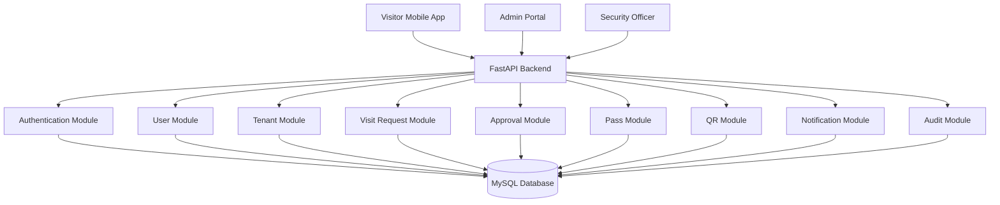
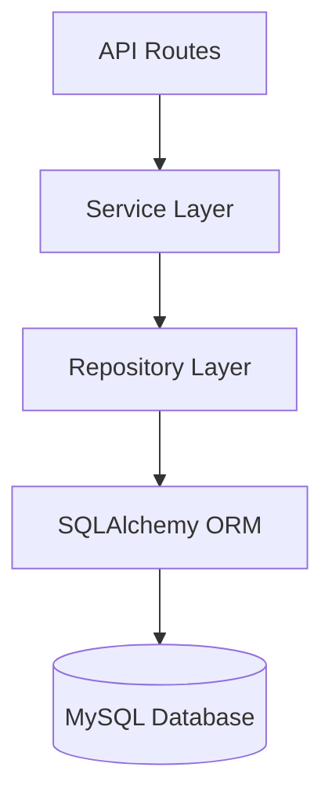

# architecture/architecture-diagram.md

# ViziCheck Architecture Diagrams

## System Overview



---

## Backend Architecture



---

## Deployment Architecture

```mermaid
flowchart TB

Users
   ↓
Flutter Mobile App

React Admin Portal
      ↓
Nginx Reverse Proxy
      ↓
FastAPI Application
      ↓
MySQL Database
      ↓
Backup Storage
```

---

## Security Architecture

```mermaid
flowchart LR

Login
  ↓
JWT Authentication
  ↓
RBAC Authorization
  ↓
Protected APIs
  ↓
Audit Logging
```

---

## Notification Architecture

```mermaid
flowchart TD

Business Event
     ↓
Notification Service
     ↓
Database Notification
     ↓
User Notification
```
