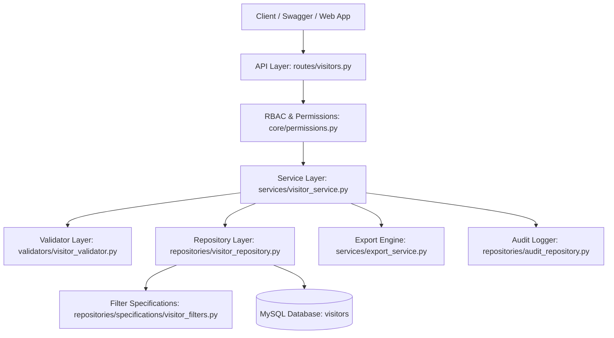
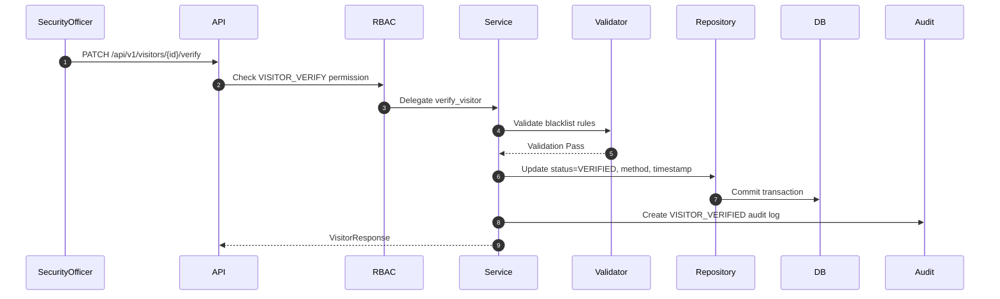

# Visitor Management Module Technical Documentation (Sprint 1 - Day 6)

## 1. Visitor Architecture

The Visitor Management Module is the core business engine of **ViziCheck**, designed under Clean Architecture and SOLID principles. It enables multi-tenant organizations to register, maintain, verify, search, blacklist, and track visitors while maintaining strict tenant isolation, RBAC security, audit trails, and high-performance querying.

---

## 2. Request Flow

1. **HTTP Request**: Endpoint caller sends request to one of the 15 `/api/v1/visitors` endpoints with standard JSON or query params.
2. **Authentication & Token Decoding**: FastAPI middleware extracts Bearer JWT token, decodes claims, verifies user status, and loads `current_user`.
3. **RBAC Permission Gate**: `PermissionChecker` verifies caller possesses required permission (`VISITOR_CREATE`, `VISITOR_READ`, `VISITOR_UPDATE`, etc.). `SUPER_ADMIN` bypasses permission check automatically.
4. **Service Processing**: `VisitorService` coordinates validation, repository persistence, and mapping.
5. **Validator Gate**: `VisitorValidator` executes tenant boundary checks, phone/email formatting, triple duplicate detection (`phone`, `email`, `government_id_number`), age validation, and blacklist rules.
6. **Repository Execution**: `VisitorRepository` executes SQL queries applying `VisitorFilters` specs.
7. **Audit Trail**: Action is recorded in `AuditLog` table with old/new state snapshots.
8. **Response Envelope**: Standardized envelope `ResponseEnvelope[VisitorResponse]` returned to caller.

---

## 3. Repository Layer (`visitor_repository.py`)

Handles all database operations using SQLAlchemy 2.0 ORM patterns:

- `generate_visitor_code`: Generates tenant-aware code format `VIS-{tenant_code}-{seq:06d}`.
- `create` & `update`: Persists and updates visitor entities.
- `soft_delete` & `restore`: Manages soft deletion flags (`is_deleted`, `deleted_at`, `deleted_by`).
- `verify_visitor`: Updates verification status (`VERIFIED`), method (`MANUAL`, `OTP`, `QR`, etc.), timestamp, and verifier user ID.
- `blacklist_visitor`: Toggles blacklist status and updates visitor status to `BLACKLISTED`.
- `get_statistics`: Computes real-time dashboard analytics (`total_visitors`, `active_visitors`, `inactive_visitors`, `blacklisted_visitors`, `verified_visitors`, `pending_verification_visitors`, `today_visitors`, `this_month_visitors`, `returning_visitors`).

---

## 4. Service Layer (`visitor_service.py`)

Orchestrates business operations while isolating domain logic from framework routes. It manages:

- Input sanitization and phone/email normalization.
- Coordination of triple duplicate checks.
- Audit log dispatching for all 15 visitor lifecycle operations.
- Delegation of CSV report generation to `ExportService`.

---

## 5. Validator Layer (`visitor_validator.py`)

Enforces validation rules prior to state mutations:

- **Format Checks**: E.164 phone regex and standard RFC email format.
- **Triple Duplicate Validation**: Prevents registering duplicate `phone`, `email`, or `government_id_number` within the same tenant.
- **Tenant Boundary Security**: Restricts `TENANT_ADMIN` and `SECURITY_OFFICER` callers to their own `tenant_id`.
- **Blacklist Restrictions**: Blocks verifying or activating visitors who are blacklisted.
- **Age Sanity**: Ensures `date_of_birth` is in the past.

---

## 6. Mapper Layer (`visitor_mapper.py`)

Maps SQLAlchemy ORM models to Pydantic DTOs:

- `to_visitor_response`: Converts ORM model to `VisitorResponse`.
- `to_paginated_response`: Wraps items list in `EnhancedPaginationResponse[VisitorResponse]` with `total_records`, `total_pages`, `has_next`, and `has_previous`.
- `to_activity_response_list`: Converts audit trail entries to `VisitorActivityResponse`.
- `to_statistics_response`: Maps analytics dictionary to `VisitorStatisticsResponse`.

---

## 7. Search & Pagination (`visitor_filters.py`)

Supports multi-column filtering and dynamic sorting:

- **Supported Search Fields**: `name`, `phone`, `email`, `company`, `government_id_number`, `visitor_code`, `status`, `verified`, `blacklisted`, `tenant_id`, and `created_at` (date range).
- **Multi-field Search**: General term search matching across `first_name`, `last_name`, `phone`, `email`, `visitor_code`, `company`, and `government_id_number`.
- **Sorting**: Configurable sort field (`created_at`, `first_name`, `visitor_code`, `status`, etc.) and direction (`asc` or `desc`).

---

## 8. Verification Workflow

---

## 9. Blacklisting Flow

Visitors identified as security risks can be blacklisted with a mandatory reason:

1. Request sent to `PATCH /api/v1/visitors/{id}/blacklist` with `blacklisted=True` and `reason`.
2. Service validates reason presence and updates visitor status to `BLACKLISTED`.
3. Audit log `VISITOR_BLACKLISTED` created.
4. Any subsequent check-in, activation, or verification attempt will be rejected by `VisitorValidator.validate_blacklist_rules`.
5. Blacklist can be removed via `PATCH /api/v1/visitors/{id}/remove-blacklist`.

---

## 10. Tenant Isolation

Multi-tenancy is enforced at database schema, repository specification, and validator levels:

- Every visitor record is indexed by `tenant_id`.
- Non-Super Admin queries automatically apply `filter(Visitor.tenant_id == current_user.tenant_id)`.
- Unique constraints (`phone`, `email`, `government_id_number`, `visitor_code`) are scoped per tenant (`idx_visitor_tenant_code`, `idx_visitor_tenant_phone`, etc.).

---

## 11. RBAC Integration

Role-Based Access Control permissions registered for Visitor operations:

- `VISITOR_CREATE`: Permission to register new visitors.
- `VISITOR_READ`: Permission to view visitor details, search, list, statistics, and activity timeline.
- `VISITOR_UPDATE`: Permission to modify visitor profiles.
- `VISITOR_DELETE`: Soft-delete permissions.
- `VISITOR_VERIFY`: Permission to verify visitor identity proofs.
- `VISITOR_BLACKLIST`: Permission to blacklist/unblacklist visitors.
- `VISITOR_EXPORT`: Permission to export visitor records to CSV.
- `VISITOR_RESTORE`: Permission to restore soft-deleted visitors.
- `VISITOR_STATUS`: Permission to activate/deactivate visitors.

---

## 12. Audit Logging

Every visitor operation generates an immutable audit record in `AuditLog` table with:

- Action types: `VISITOR_CREATED`, `VISITOR_UPDATED`, `VISITOR_VERIFIED`, `VISITOR_BLACKLISTED`, `VISITOR_BLACKLIST_REMOVED`, `VISITOR_RESTORED`, `VISITOR_DELETED`, `VISITOR_ACTIVATED`, `VISITOR_DEACTIVATED`.
- Metadata: `user_id` (operator), `entity_id` (visitor ID), `ip_address`, `old_value` JSON, `new_value` JSON, timestamp.

Timeline activity endpoint `GET /api/v1/visitors/{id}/activity` exposes this audit history.

---

## 13. Security Considerations

- **SQL Injection Prevention**: Built entirely with SQLAlchemy ORM query builders and parametrized SQL.
- **Input Validation**: Pydantic schemas enforce type safety and length limits.
- **Data Protection**: Government ID numbers and documents are protected within tenant boundaries.
- **Audit Traceability**: Every write operation logs client IP address and acting user ID.

---

## 14. Scalability

- **Database Indexing**: Compound indexes on `(tenant_id, visitor_code)`, `(tenant_id, phone)`, `(tenant_id, email)`, and `(tenant_id, government_id_number)`.
- **Paginated Queries**: Offsets and limits restrict payload sizes.
- **Extensible Export**: `ExportService` interface allows switching from streaming CSV to background worker jobs (Celery/Redis) for multi-million row datasets.

---

## 15. Technical Interview Questions & Answers

### Q1: How is tenant isolation enforced in the Visitor module?
**Answer**: Tenant isolation is enforced at three distinct layers:
1. **Database Schema**: `tenant_id` foreign key with composite unique indexes `(tenant_id, field)`.
2. **Repository Specifications**: All queries automatically filter by `tenant_id == current_user.tenant_id` for non-Super Admin users.
3. **Validator Layer**: Mismatched tenant IDs between caller and target resource trigger an `AuthorizationException` (HTTP 403).

### Q2: Why separate `status` and `verification_status` into two distinct enums?
**Answer**: Separation of concerns. `status` (`ACTIVE`, `INACTIVE`, `BLACKLISTED`, `PENDING`) represents general operational status, while `verification_status` (`PENDING`, `VERIFIED`, `REJECTED`, `EXPIRED`) specifically tracks identity document verification state. This allows an `ACTIVE` visitor to be `PENDING` identity verification without locking their account state prematurely.

### Q3: How does tenant-aware visitor code generation guarantee uniqueness under concurrent requests?
**Answer**: Visitor code format `VIS-{tenant_code}-{seq:06d}` uses `func.max(Visitor.id) + 1` combined with a unique composite database index on `(tenant_id, visitor_code)`. In case of concurrent collisions, MySQL raises a duplicate key error which triggers a retry or transaction rollback.

### Q4: How is soft deletion handled without breaking unique constraints?
**Answer**: Soft deletion uses `SoftDeleteMixin` setting `is_deleted = True` and `deleted_at`. Unique index checks inside `VisitorValidator` query active non-deleted records (`is_deleted IS False`), allowing previously soft-deleted numbers or IDs to be re-registered if needed.

### Q5: How does the system handle visitor activity tracking?
**Answer**: Through `AuditRepository` and `GET /api/v1/visitors/{id}/activity`. When a visitor is created, updated, verified, or blacklisted, `AuditRepository.create_audit_log` persists an audit log entry under `module="VISITOR_MANAGEMENT"`. The activity endpoint retrieves this timeline ordered chronologically.
