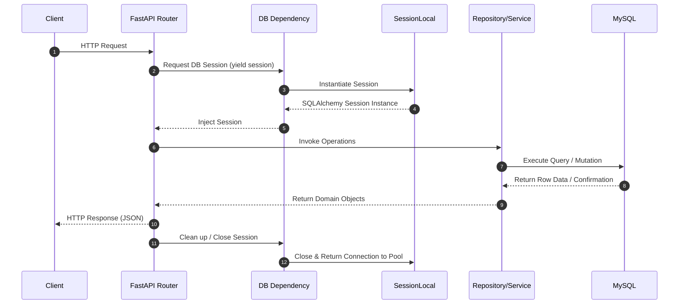
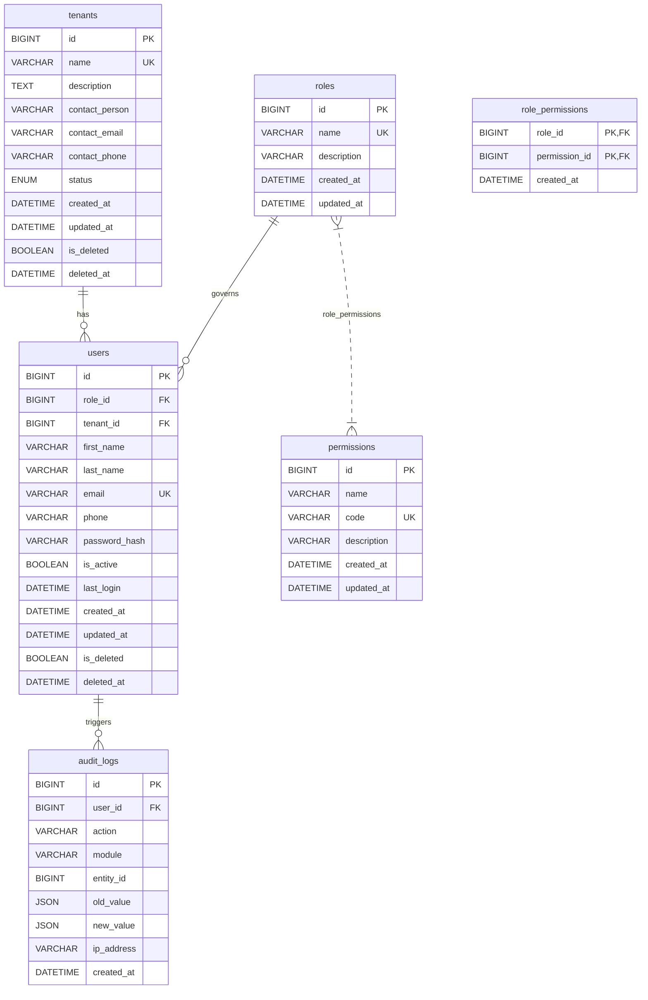
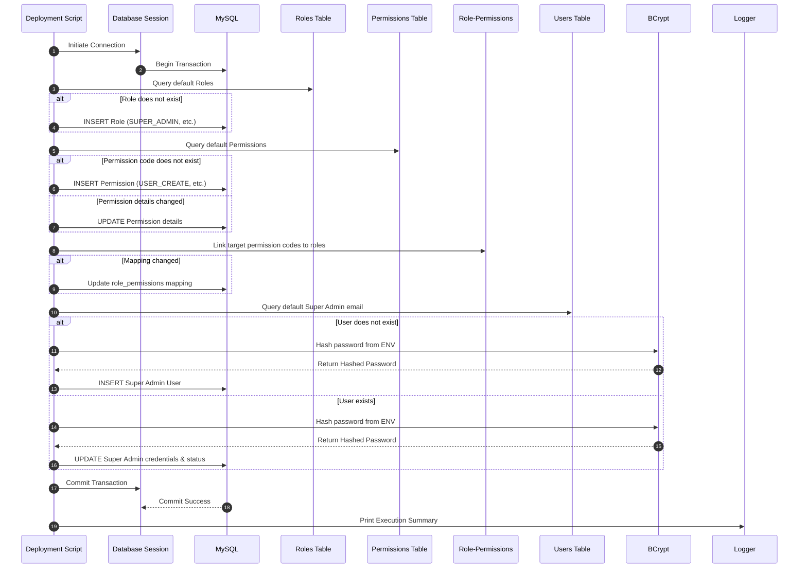

# ViziCheck Backend Explanation: Database Foundation & RBAC Schema

This document provides a comprehensive, production-oriented explanation of the Database Foundation and Role-Based Access Control (RBAC) persistence layer implemented in ViziCheck. It serves as an onboarding guide for new developers, a system architecture reference for AI coding agents, and a technical design brief for system maintenance.

---

## 1. Feature Overview
The Database Foundation layer establishes the core persistence mechanism for the ViziCheck system. It provides:
- Declarative object-relational mappings (ORM) for key identity and platform entities.
- Dynamic migration capabilities using Alembic.
- A standardized soft-delete pattern across transient entities.
- A secure, idempotent bootstrapping and seeding framework for system configuration.
- A unified transactional audit logging mechanism.

---

## 2. Purpose
A secure and high-performing visitor management system requires an immutable source of truth for identity, tenant partitioning, authorization rules, and administrative tracking. This foundation ensures that all downstream modules (Authentication, Visit Requests, Check-in/Check-out, Notification, Reporting) inherit a consistent data model, strict database constraints, and standardized lifecycle helpers.

---

## 3. Responsibilities
The Database Foundation layer is responsible for:
- **Tenant Management**: Representing tenant organizational units and enforcing partition status (`ACTIVE`, `INACTIVE`, `SUSPENDED`).
- **Authorization Mapping**: Maintaining a many-to-many relationship between system permissions and organizational roles.
- **Identity Storage**: Storing user accounts, linking them to tenants, and securing their credential hashes.
- **Activity Auditing**: Providing audit log hooks to record critical mutation operations.
- **Schema Management**: Managing incremental updates to the relational schema without downtime or data loss.
- **Bootstrapping**: Bootstrapping system roles, permission mappings, and the initial system administrator idempotently.

---

## 4. Business Requirements
- **Tenant Isolation**: Users (except global Super Admins) must be scoped to a specific tenant.
- **Granular Permissions**: Fine-grained permissions (e.g., `USER_CREATE`, `QR_VALIDATE`) must govern access to endpoints and actions rather than monolithic roles.
- **Soft Deletion**: Tenants and users cannot be hard deleted; they must be soft-deleted to preserve historical audit logs and visit history.
- **Idempotency**: Bootstrapping scripts must be safe to execute multiple times (e.g., in CI/CD pipelines) without generating duplicate records or resetting custom runtime modifications.
- **Compliance Tracking**: Every security-sensitive mutation must be auditable, linking the event to a specific user, action, timestamp, and IP address.

---

## 5. Folder Structure
The persistence configuration, models, migrations, and initialization scripts are structured as follows:

```text
backend/
├── alembic/
│   ├── env.py                  # Alembic environment file (registers dynamic models)
│   └── versions/               # Incremental schema migration scripts
├── app/
│   ├── models/                 # SQLAlchemy 2.0 Declarative Models
│   │   ├── __init__.py         # Core package exports (exposed to Alembic)
│   │   ├── audit_log.py        # AuditLog mapping
│   │   ├── mixins.py           # Reusable model mixins (SoftDeleteMixin)
│   │   ├── permission.py       # Permission mapping
│   │   ├── role.py             # Role mapping
│   │   ├── role_permission.py  # Many-to-many role_permissions table
│   │   ├── tenant.py           # Tenant mapping & TenantStatus Enum
│   │   └── user.py             # User mapping & foreign key indexes
│   └── utils/
│       └── logger.py           # Core logging module
├── database/
│   ├── base.py                 # DeclarativeBase setup
│   └── session.py              # Engine setup & SessionLocal factory
├── scripts/
│   └── seed_database.py        # Idempotent database bootstrapping script
├── .env                        # Environment configurations (local overrides)
└── config.py                   # Pydantic base settings class
```

---

## 6. Files Involved
*   **[session.py](file:///c:/Users/hp/vizicheck/backend/database/session.py)**: Configures the SQLAlchemy connection engine, pool size (max 20 connections, overflow 10), and session factory.
*   **[mixins.py](file:///c:/Users/hp/vizicheck/backend/app/models/mixins.py)**: Contains the `SoftDeleteMixin` providing standardized `is_deleted` (Boolean) and `deleted_at` (DateTime) fields.
*   **[tenant.py](file:///c:/Users/hp/vizicheck/backend/app/models/tenant.py)**: Maps the `tenants` table with an enum configuration for status checking.
*   **[role.py](file:///c:/Users/hp/vizicheck/backend/app/models/role.py)**: Maps the `roles` table, defining roles such as `SUPER_ADMIN`, `TENANT_ADMIN`, `SECURITY_OFFICER`, and `VISITOR`.
*   **[permission.py](file:///c:/Users/hp/vizicheck/backend/app/models/permission.py)**: Maps the `permissions` table, enforcing unique codes (`code`) for programmatic access control.
*   **[role_permission.py](file:///c:/Users/hp/vizicheck/backend/app/models/role_permission.py)**: Declares the join table linking `roles` and `permissions` with cascading deletes.
*   **[user.py](file:///c:/Users/hp/vizicheck/backend/app/models/user.py)**: Maps `users` to their authentication credentials, active state, role, and tenant.
*   **[audit_log.py](file:///c:/Users/hp/vizicheck/backend/app/models/audit_log.py)**: Maps `audit_logs` using JSON structures to store state transitions (`old_value` / `new_value`).
*   **[seed_database.py](file:///c:/Users/hp/vizicheck/backend/scripts/seed_database.py)**: Runs bootstrapping logic, linking permissions, roles, and creating the default Super Admin based on Pydantic configurations.

---

## 7. Request Lifecycle
When a client requests a resource, the database session is scoped to the lifecycle of the HTTP request:



- **Instantiation**: The database session is requested via a FastAPI dependency (`get_db`) using `yield`.
- **Transaction Scope**: Multiple repositories read from the same session. Mutations are committed at the service or routing boundary.
- **Resource Cleanup**: When the router exits, the dependency block resumes, closing the session and returning the connection to the SQLAlchemy pool.

---

## 8. Clean Architecture Layer Explanation

```text
┌────────────────────────────────────────────────────────┐
│                        API Layer                       │
│    (FastAPI Routers / HTTP Request Handling / DTOs)    │
└───────────────────────────┬────────────────────────────┘
                            ▼
┌────────────────────────────────────────────────────────┐
│                      Service Layer                     │
│    (Business Logic / Transactions / Rules / Seeding)   │
└───────────────────────────┬────────────────────────────┘
                            ▼
┌────────────────────────────────────────────────────────┐
│                    Repository Layer                    │
│    (Data Access Patterns / Query Filtering / ORM)      │
└───────────────────────────┬────────────────────────────┘
                            ▼
┌────────────────────────────────────────────────────────┐
│                   Data/Model Layer                     │
│    (SQLAlchemy Models / Schemas / Migrations / DB)     │
└────────────────────────────────────────────────────────┘
```

The database setup fits within **Clean Architecture** as follows:
1.  **Data/Model Layer (`app/models/`)**: Defines the physical representation of entities in the database. These are pure data structures decoupled from API execution.
2.  **Repository Layer (`app/repositories/`)**: Abstracted interfaces that query and write models. Services never execute raw queries directly.
3.  **Service Layer (`app/services/`)**: Orchestrates business tasks, commits transactions, hashes passwords, and triggers audit logging.
4.  **API Layer (`app/api/`)**: Handlers that receive JSON DTOs, request db sessions from the dependency injection container, invoke services, and return REST payloads.

---

## 9. Database Tables and Relationships
Below is the schema diagram and relationship outline for the identity and RBAC tables:



### Key Relationships
- **Tenants to Users (One-to-Many)**: A Tenant can host multiple Users. A User (except Super Admin) is mapped to one Tenant.
- **Roles to Users (One-to-Many)**: Every user must possess exactly one Role (`SUPER_ADMIN`, `TENANT_ADMIN`, `SECURITY_OFFICER`, `VISITOR`).
- **Roles to Permissions (Many-to-Many)**: Managed via the `role_permissions` join table. Role updates automatically update the associated permissions.
- **Users to Audit Logs (One-to-Many)**: Changes performed in the system are associated with the acting User's ID via a nullable foreign key (allowing system-generated tasks to execute under null).

---

## 10. Business Logic Explanation
-   **Soft Deletion**: When an administrator deletes a Tenant or a User, the database executes an update statement instead of a deletion. The `is_deleted` field is set to `True`, and `deleted_at` captures the execution timestamp. Query managers automatically append `is_deleted = False` filters to all active lookups.
-   **Tenant State Machine**:
    *   `ACTIVE`: Fully operational. Users can log in, request visits, and approve actions.
    *   `INACTIVE`: Temporary shutdown. Authentication requests for users belonging to this tenant are blocked.
    *   `SUSPENDED`: Violation or billing suspension. All access is blocked, and active sessions are immediately invalidated.
-   **Bootstrapping & Seeding Idempotency**:
    *   Roles are checked by name; if absent, they are generated.
    *   Permissions are matched by `code`. If details (name, description) differ in the script from the database, they are updated in place to maintain sync.
    *   Mappings are synchronized by comparing existing permission lists. Redundant entries are skipped, and missing ones are added.
    *   Default Super Admin user creation reads the credentials from environment configuration. If the account already exists, the password is refreshed and its active state is guaranteed.

---

## 11. Validation Rules
-   **Email Validity**: Enforced at the model level via `unique=True` constraints on the database index. The service layer verifies uniqueness before issuing create commands.
-   **Constraint Guardrails**:
    *   Role associations use `ondelete="RESTRICT"`. A role cannot be deleted if users are currently assigned to it.
    *   Tenant associations use `ondelete="SET NULL"`. If a tenant is deleted, its user accounts lose context but remain in the database for auditing purposes.
    *   Role-Permission associations use `ondelete="CASCADE"`. Deleting a role or permission cleans up the mapping table automatically.

---

## 12. Security Considerations
-   **Password Storage**: Passwords must never be stored in plain text. ViziCheck utilizes `bcrypt` for one-way cryptographic hashing (12 salt rounds).
-   **Credential Injection**: The bootstrapping configuration reads credentials from environment variables (`DEFAULT_SUPER_ADMIN_EMAIL`, `DEFAULT_SUPER_ADMIN_PASSWORD`). Production configurations must never use fallback values.
-   **Least Privilege Principle**: System administrators operate with full access, while Tenants, Security Officers, and Visitors operate under restricted permission lists, ensuring they cannot read or write data outside of their tenant boundary.

---

## 13. Error Handling
-   **Database Exceptions**: Catching `SQLAlchemyError` blocks protects against internal error exposure. The system returns generic `500 Internal Server Error` messages to the client and logs the detailed stack trace to secure server files.
-   **Uniqueness Violations**: If a user registration fails due to an existing email, `IntegrityError` is intercepted and transformed into a user-friendly `400 Bad Request` explaining that the email is already in use.
-   **Active Session Checks**: If a Tenant status shifts to `INACTIVE` or `SUSPENDED`, session validation middleware blocks subsequent request lifecycles.

---

## 14. Production Best Practices
-   **Connection Recycling**: Set `pool_recycle=3600` to prevent stale connections and mysql timeouts.
-   **Pre-Deployment Migrations**: Alembic migrations must run as part of the release pipeline (e.g., in a Helm pre-install hook or Docker entrypoint) before the application container starts accepting traffic.
-   **Environment Separation**: The `.env` file should be excluded from Git commits using `.gitignore`. Use secrets managers (e.g., AWS Secrets Manager, HashiCorp Vault, Kubernetes Secrets) to populate configurations dynamically.

---

## 15. Scalability Considerations
-   **Read/Write Split**: For heavy traffic scenarios, the session manager can be extended to use a write-master database node and multiple read-replicas.
-   **Indexing**: Fields queried frequently (such as user email, foreign keys, status flags, and timestamps) are indexed to prevent full table scans.
-   **Sharding (Future)**: The `tenant_id` column provides a clear path for database sharding, allowing the platform to split storage across separate databases as tenant size scales.

---

## 16. Performance Optimizations
-   **Relationship Loading**: By default, SQLAlchemy uses lazy loading, which can cause N+1 query problems. Use `joinedload` for one-to-one relationships (e.g., loading a User with their Role) and `selectinload` for one-to-many relationships (e.g., loading a Role with its Permissions).
-   **Index Coverage**: Indices exist on `users.email` for authentication checks, `users.role_id` and `users.tenant_id` for join performance, and `audit_logs.user_id`/`audit_logs.created_at` for audit filtering.
-   **JSON Column Usage**: The `AuditLog` table stores historical state changes as JSON, avoiding complex EAV schema joins.

---

## 17. Future Improvements
-   **Soft Delete Filter**: Implement a custom SQLAlchemy mapper option to automatically filter out soft-deleted records at the session level without needing explicit `.filter_by(is_deleted=False)` criteria.
-   **Tenant Partitioning**: Implement PostgreSQL/MySQL partitioning by `tenant_id` to speed up tenant-specific queries.
-   **Audit Log Archiving**: Implement an automated partition-archiving pipeline to move logs older than 90 days to warm/cold storage (e.g., S3 Glacier).

---

## 18. Interview Explanation
> **"How would you explain the design of this database foundation layer in a technical interview?"**
>
> *"In designing the ViziCheck backend persistence layer, I followed Clean Architecture principles to construct a secure and scalable multi-tenant identity foundation. I implemented declarative SQLAlchemy 2.0 ORM mappings for tenants, roles, permissions, users, and audit logs. 
> To ensure security and maintainability, I decoupled authorization from roles by establishing a granular permission-based system mapped through a many-to-many relationship. I handled soft deletes systematically via a custom mixin to preserve system auditing integrity. 
> Furthermore, I designed an idempotent seeding script to safely bootstrap roles, permissions, and default administrators during deployment cycles, reading credentials directly from secure environment variables. For performance, I defined indexes on foreign keys, email lookups, and timestamps, preventing table scans as the application scales."*

---

## 19. Industry Standards Followed
-   **SOLID Principles**: Models are single-purpose; the mixin pattern handles orthogonal concerns (Soft Delete) without violating single-responsibility.
-   **12-Factor App methodology**: All configuration is stored in the environment, loaded via Pydantic settings, and kept separate from code.
-   **OWASP Top 10 Guidelines**: Passwords are secure-hashed using `bcrypt` (12 rounds) to mitigate credential compromise. Prepared statements (via SQLAlchemy's parameterized compiler) prevent SQL Injection.
-   **Clean Architecture**: Separation of concerns ensures that the database structures do not dictate business domain entities.

---

## 20. Sequence Diagram (Bootstrapping Flow)



---

## 21. Why This Design Was Chosen
-   **SQLAlchemy 2.0 type-safety**: Utilizing modern `Mapped[...]` and `mapped_column(...)` structures enforces static analysis and editor autocompletion, minimizing runtime exceptions.
-   **Alembic Migration Tooling**: The automated schema detection maps directly to models, ensuring migrations remain in lock-step with development.
-   **Granular RBAC**: Monolithic role-based checks (e.g. `is_admin`) degrade rapidly as requirements change. Mapping actions to permission codes keeps endpoint enforcement decoupled from role naming schemes.

---

## 22. Key Takeaways
-   **Platform Partitioning**: The database foundation provides robust tenant isolation and statuses to handle multi-client deployments.
-   **Robust Auditing**: JSON audit logs simplify transaction history tracking.
-   **Production Bootstrapping**: Secure environment variables prevent hardcoded administrative passwords in repository commits.
-   **Optimized Execution**: Index and pool optimizations prevent typical database scaling bottlenecks.
