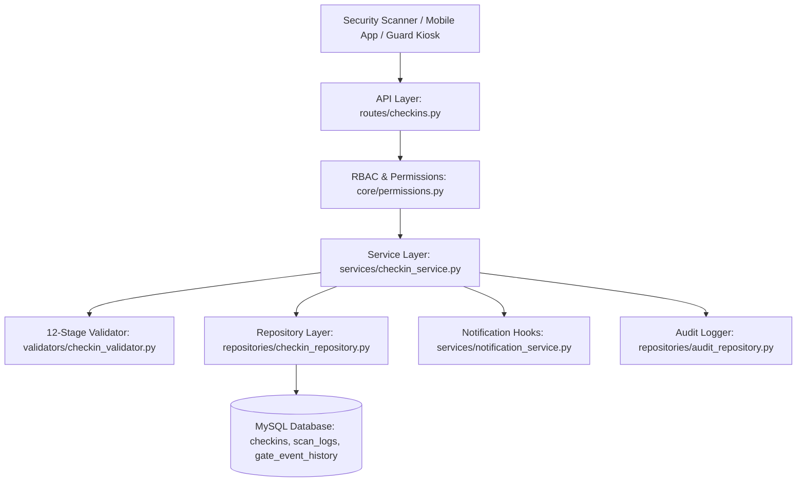

# Sprint 1 – Day 10: Gate Check-In & Check-Out Management Module Documentation

## 1. Module Overview

The **Gate Security & Check-In/Out Management Module** is the frontline execution and security validation engine of **ViziCheck**. Designed under Clean Architecture and SOLID principles, this module authenticates gate devices, validates visitor QR passes against a 12-stage security pipeline, records entry and exit events, computes exact visit durations, updates pass and visit request status state machines, dispatches real-time host notifications, tracks failed scan attempts for threat intelligence, and presents real-time occupancy metrics via live security dashboards.



---

## 2. Gate Security & Life-Cycle Workflow

```
Approved Visit Request ➔ Visitor Pass & QR Generated ➔ Visitor Arrives at Gate
                                                               │
                                                               ▼
                                                       Security Scans QR
                                                               │
                                                               ▼
                                                  12-Stage Security Pipeline
                                                               │
                                      ┌────────────────────────┴────────────────────────┐
                                      ▼                                                 ▼
                              [Scan FAILED]                                     [Scan SUCCESS]
                                      │                                                 │
                                      ▼                                                 ▼
                         Log Failure in scan_logs                          Create CheckIn Record
                        Return Specific Error Code                       Pass Status ➔ USED
                                                                         Visit Status ➔ CHECKED_IN
                                                                         Notify Host via SMS/Email
                                                                                        │
                                                                                        ▼
                                                                                Visitor Exits Gate
                                                                                        │
                                                                                        ▼
                                                                                Exit QR Scan
                                                                                        │
                                                                                        ▼
                                                                            Update Checkout Timestamp
                                                                          Compute Duration (Mins/Secs)
                                                                          Pass Status ➔ COMPLETED
                                                                          Visit Status ➔ COMPLETED
                                                                          Notify Host of Departure
```

---

## 3. Core Enterprise Features

### 3.1 Authenticated Gate Device Management
Instead of simple device strings, every gate scan authenticates and records device metadata:
- `gate_device_id`: Unique hardware identifier (e.g. `DEV-GATE-NORTH-01`)
- `scanner_name`: Descriptive scanner name (e.g. `North Gate Scanner`)
- `scanner_ip`: Hardware IP address (e.g. `192.168.1.105`)
- `scanner_location`: Physical facility entrance (e.g. `Building A North Lobby`)
- `scanner_version`: Firmware/software build version (e.g. `v1.2.0`)

### 3.2 12-Stage Security & QR Validation Pipeline
Implemented in [checkin_validator.py](file:///c:/Users/hp/vizicheck/backend/app/validators/checkin_validator.py), every scan executes 12 validation steps:
1. **QR Payload Parsing**: Extracts JWT string from `VIZICHECK:PASS:<uuid>:V1:<jwt>`.
2. **Cryptographic JWT Signature Verification**: Validates token using secret key and HMAC-SHA256 algorithm.
3. **JWT Expiry Check**: Rejects expired tokens.
4. **QR Version Verification**: Compares token version with `visitor_passes.latest_qr_version` to reject old QR screenshots.
5. **Tenant Isolation Enforcement**: Dynamically resolves and matches tenant boundaries (`Pass Tenant ID == Gate/User Tenant ID`).
6. **Pass Existence & Soft-Delete Check**: Ensures pass exists and has not been deleted.
7. **Duplicate Scan Prevention**: Rejects check-in if visitor is already checked in.
8. **Pass Status Validation**: Validates pass status (`ACTIVE` allowed; `REVOKED`, `EXPIRED`, `COMPLETED` rejected).
9. **Validity Time Window**: Ensures current time is within `valid_from` and `valid_until`.
10. **Visit Request Validation**: Ensures associated visit request is in `APPROVED` status.
11. **Visitor Account Status**: Rejects blacklisted or inactive visitors.
12. **Record Creation**: Creates `CheckIn` record and logs scan result.

### 3.3 Scan Log Analytics (`scan_logs` Table)
Stores both successful and failed scan attempts with granular `GateVerificationStatus` reasons (`SUCCESS`, `FAILED`, `EXPIRED`, `REVOKED`, `INVALID_SIGNATURE`, `WRONG_TENANT`, `ALREADY_CHECKED_IN`, `UNKNOWN_QR`, `PASS_EXPIRED`, `REQUEST_INVALID`, `VISITOR_INACTIVE`, `NOT_CHECKED_IN`).

### 3.4 Automated Attendance Duration
Upon exit check-out, the system automatically computes:
- `visit_duration_minutes`: Floating point minutes (e.g. `52.40`)
- `visit_duration_seconds`: Total seconds (e.g. `3144`)

### 3.5 Real-Time Live Security Occupancy Dashboard
The `GET /api/v1/checkins/live-dashboard` endpoint compiles live facility operational metrics:
- `visitors_inside`: Visitors currently checked in
- `todays_entries`: Total check-ins recorded today
- `todays_exits`: Total check-outs recorded today
- `pending_exits`: Overdue visitors still inside
- `peak_occupancy_today`: Highest simultaneous visitor count today
- `average_visit_duration_minutes`: Average duration of completed visits today
- `visitors_inside_by_gate`: Visitor count grouped by entry gate
- `visitors_inside_by_department`: Visitor count grouped by host department
- `recent_activities`: Timeline of recent security events

### 3.6 Background Overstay Cleanup Scheduler
The job in [checkin_cleanup_scheduler.py](file:///c:/Users/hp/vizicheck/backend/background_jobs/checkin_cleanup_scheduler.py):
- Evaluates active visitors whose `scheduled_end_time` has passed.
- Dispatches overstay alerts to host and security personnel (`notify_overstay`).
- Auto-completes stale visits exceeding 24 hours.

### 3.7 Admin Undo Check-In
Allows security administrators (`PATCH /api/v1/checkins/{id}/undo`) to reverse accidental check-in scans, reverting pass status to `ACTIVE` and visit request status to `APPROVED` while recording an audit history.

---

## 4. Clean Architecture Layer Breakdown

| Layer | File Path | Responsibilities |
| :--- | :--- | :--- |
| **Data Models** | [checkin.py](file:///c:/Users/hp/vizicheck/backend/app/models/checkin.py) | Defines `CheckIn`, `ScanLog`, `GateEventHistory`, `CheckInStatus`, `GateVerificationStatus`. |
| **DTO Schemas** | [checkin_schema.py](file:///c:/Users/hp/vizicheck/backend/app/schemas/checkin_schema.py) | Pydantic V2 request/response models (`QRCheckInRequest`, `LiveDashboardResponse`, etc.). |
| **Data Mapper** | [checkin_mapper.py](file:///c:/Users/hp/vizicheck/backend/app/mappers/checkin_mapper.py) | Converts SQLAlchemy ORM entities to DTO responses with populated visitor/host details. |
| **Repository** | [checkin_repository.py](file:///c:/Users/hp/vizicheck/backend/app/repositories/checkin_repository.py) | Handles DB queries, occupancy counts, peak calculations, scan logs, and gate event logging. |
| **Validator** | [checkin_validator.py](file:///c:/Users/hp/vizicheck/backend/app/validators/checkin_validator.py) | Enforces 12-stage validation pipeline, tenant isolation, and manual checkin/checkout rules. |
| **Service Layer**| [checkin_service.py](file:///c:/Users/hp/vizicheck/backend/app/services/checkin_service.py) | Orchestrates check-in/out, dashboard assembly, CSV export, notifications, and undo. |
| **API Router** | [checkins.py](file:///c:/Users/hp/vizicheck/backend/app/api/routes/checkins.py) | Exposes REST endpoints with RBAC permission enforcement. |

---

## 5. API Endpoint Specifications

| Method | Endpoint | Permission Code | Description |
| :--- | :--- | :--- | :--- |
| `POST` | `/api/v1/checkin/scan` | `CHECKIN_CREATE` | Execute QR scan entry check-in |
| `POST` | `/api/v1/checkin/manual` | `CHECKIN_MANUAL` | Manual check-in override for security guard |
| `POST` | `/api/v1/checkout/scan` | `CHECKOUT_CREATE` | Execute QR scan exit check-out |
| `POST` | `/api/v1/checkout/manual` | `CHECKOUT_MANUAL` | Manual check-out override |
| `GET` | `/api/v1/checkins/live-dashboard` | `GATE_DASHBOARD_VIEW` | Fetch real-time security occupancy dashboard |
| `GET` | `/api/v1/checkins` | `CHECKIN_READ` | Paginated check-in activity timeline |
| `GET` | `/api/v1/checkins/active` | `CHECKIN_READ` | List visitors currently inside facility |
| `GET` | `/api/v1/checkins/statistics` | `GATE_DASHBOARD_VIEW` | Summary check-in metrics |
| `GET` | `/api/v1/checkins/scan-logs` | `SCAN_LOGS_VIEW` | List QR scan failure and success attempt logs |
| `GET` | `/api/v1/checkins/export` | `CHECKIN_EXPORT` | Export check-in records to CSV |
| `GET` | `/api/v1/checkins/{id}` | `CHECKIN_READ` | Fetch single check-in record details |
| `PATCH` | `/api/v1/checkins/{id}/undo` | `CHECKIN_UNDO` | Admin undo check-in record |

---

## 6. Unit Test Coverage & Verification

Automated test suite in [test_checkin.py](file:///c:/Users/hp/vizicheck/backend/tests/checkin/test_checkin.py):
- `test_qr_scan_checkin_and_checkout_flow` PASSED
- `test_manual_checkin_and_checkout_flow` PASSED
- `test_duplicate_checkin_prevention` PASSED
- `test_invalid_qr_logs_scan_failure` PASSED
- `test_live_dashboard_and_active_visitors` PASSED
- `test_undo_checkin_flow` PASSED
- `test_overdue_checkin_cleanup_scheduler` PASSED

Full test suite status: **60 / 60 tests passing (100% pass rate)**.
