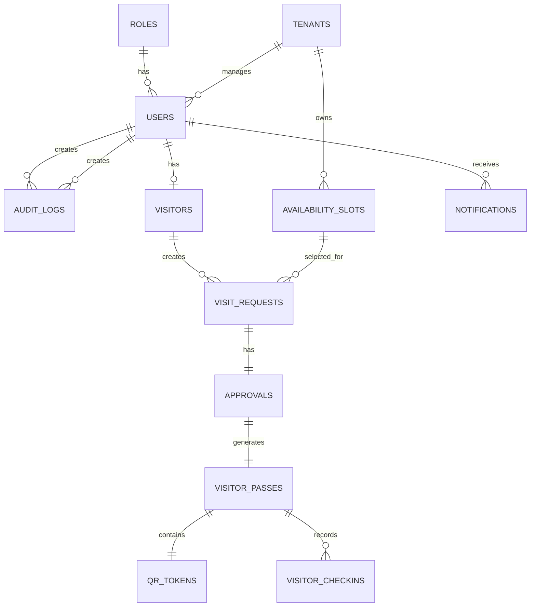

# architecture/er-diagram.md

# ViziCheck Entity Relationship Diagram

## Core Relationships

---

## Primary Entities

Roles

Users

Tenants

Visitors

Availability Slots

Visit Requests

Approvals

Visitor Passes

QR Tokens

Visitor Checkins

Notifications

Audit Logs

---

## Database Design Rules

Primary Key:

id

Foreign Key:

entity_id

Soft Delete:

supported

Audit Columns:

created_at

updated_at

created_by

updated_by
