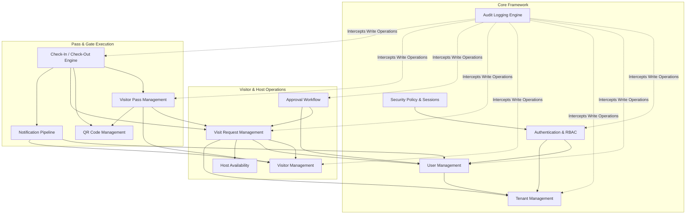

# Module Dependency Diagram

The following Mermaid diagram illustrates the architectural dependencies and inter-module communications across all integrated Sprint 1 backend modules in **ViziCheck**.

## Module Interactions Summary

1. **Auth & Security**: Manages JWT lifecycle, RBAC permission verification, account lockout policies, and session tracking.
2. **Tenants & Users**: Enforces multi-tenant data isolation across all database queries.
3. **Visit Request & Availability**: Validates host working hours and slot limits before creating visit requests.
4. **Approval & Pass Generation**: Auto-triggers visitor pass and cryptographically signed QR token upon request approval.
5. **Gate Security & Check-In**: Runs 12-stage validation pipeline on QR scan, updates occupancy metrics, and dispatches instant host notifications.
6. **Audit & Logging**: Asynchronously logs state modifications across all system operations.
