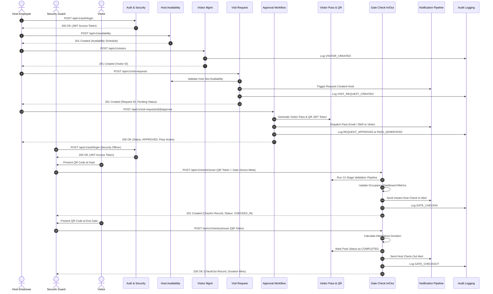
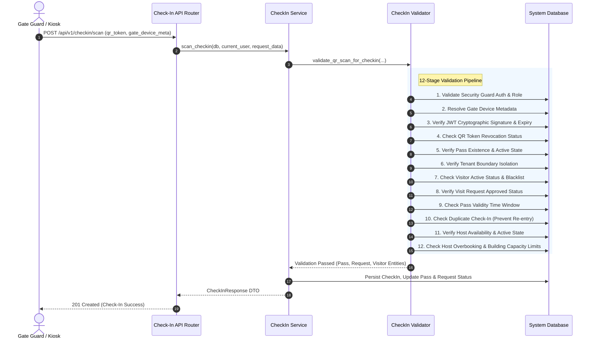

# ViziCheck End-to-End Sequence Diagrams

This document contains full sequence diagrams modeling the core operational flows of the **ViziCheck** Smart Visitor Management System.

---

## 1. End-to-End Visitor Lifecycle Flow

---

## 2. Gate Verification & 12-Stage Security Pipeline

